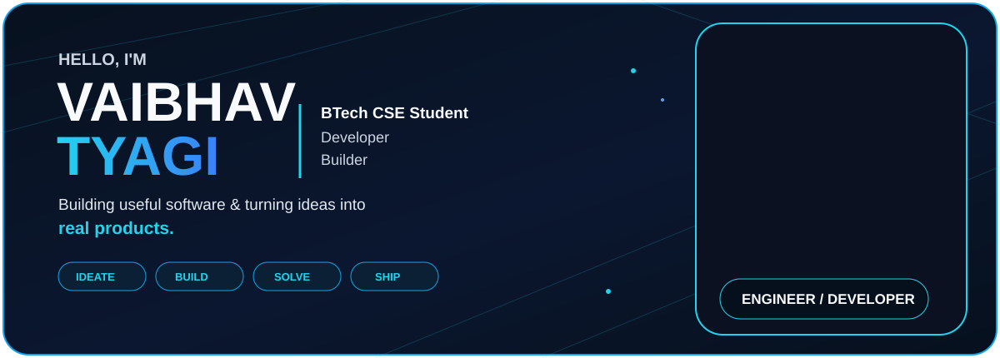

 

  

&nbsp;

---

<table>
<tr>
<td width="58%" valign="top">

<h2>01 / FROM THOUGHT TO THING</h2>

# IDEAS. BUILT DIFFERENT.

I build practical digital products that turn everyday problems into simple, useful software.

 

**01 IDEATE** → **02 DESIGN** → **03 BUILD** → **04 TEST** → **05 SHIP**

 

### 💻 SOFTWARE DEVELOPMENT
Building useful digital products from idea to deployment.

### 🤖 AI & CLOUD
Exploring AI-powered applications, automation and cloud systems.

### 🧠 PROBLEM SOLVING
Improving programming fundamentals, DSA and logical thinking.

### 🚀 PRODUCT BUILDING
Turning ideas into real products.

</td>

<td width="42%" valign="top">

<h2>02 / LIFE OUTSIDE THE CODE</h2>

# MORE THAN A JOB TITLE.

### 🎓 BTECH CSE
Computer Science & Engineering student.

### 💻 DEVELOPER
Building digital products and utilities.

### 🚀 BUILDER
Turning ideas into working products.

### 🧠 LEARNER
Always exploring new technology.

 

**CURRENT FOCUS**

`DSA` · `AI` · `CLOUD` · `PRODUCT BUILDING`

</td>
</tr>
</table>

---

<h2>03 / SELECTED WORK</h2>

# THINGS I'M BUILDING.

<table>
<tr>
<td width="33%" valign="top">

## 🧾 PakkaBill

**GST BILLING**

Modern billing and inventory management platform for businesses.

`GST` `Billing` `Business`

</td>

<td width="33%" valign="top">

## 🏛️ PanchayatAI

**SMART SOCIETY MANAGEMENT**

Digital management platform for housing societies, residents and administration.

`AI` `Management` `Society`

</td>

<td width="33%" valign="top">

## 🚇 MetroSetu

**METRO ALL IN ONE**

Transit platform bringing metro and regional transit information together.

`Transit` `Metro` `Travel`

</td>
</tr>

<tr>
<td width="33%" valign="top">

## 💻 CodeMaster

**CREATE · CODE · COMPILE**

Online coding environment for writing, running and testing programs.

`Compiler` `Coding` `Developer Tool`

</td>

<td width="33%" valign="top">

## 📊 Investudio Pro

**INVESTMENT PLATFORM**

Modern platform focused on investment and financial information.

`Finance` `Investment`

</td>

<td width="33%" valign="top">

## 🔳 GetAllQR

**QR UTILITY PLATFORM**

Tools for creating and working with QR codes.

`QR` `Utility`

</td>
</tr>

<tr>
<td width="33%" valign="top">

## 📄 DocuFlow

**PDF TOOLKIT**

Browser-based document and PDF utilities for everyday workflows.

`PDF` `Documents` `Productivity`

</td>

<td width="33%" valign="top">

## 🌦️ MausamSetu

**LIVE WEATHER UPDATES**

Weather platform designed to provide simple and useful weather information.

`Weather` `Forecast`

</td>

<td width="33%" valign="top">

## 🎓 StudentToolkit

**TOOLS FOR STUDENTS**

Academic and student productivity utilities.

`Education` `Students` `Productivity`

</td>
</tr>
</table>

---

<table>
<tr>
<td width="50%" valign="top">

<h2>04 / TECH STACK</h2>

# TOOLS I BUILD WITH.

### PROGRAMMING LANGUAGES

### TOOLS & PLATFORMS

</td>

<td width="50%" valign="top">

<h2>05 / CURRENTLY LEARNING</h2>

# ALWAYS LEARNING.

### 🧩 DATA STRUCTURES
Arrays · Linked Lists · Algorithms · Problem Solving

### 🗄️ DATABASES
Database Design · SQL · Data Management

### 🤖 AI
AI Tools · Automation · GenAI · Intelligent Apps

</td>
</tr>
</table>

---

<h2>06 / GITHUB ACTIVITY</h2>

  

---

<h2>07 / CONTRIBUTION GRAPH</h2>

---

# BUILD SOMETHING USEFUL.

**Learn something new. Build something real. Then make it better.**

 

  

  

**MADE WITH ❤️ IN INDIA**

